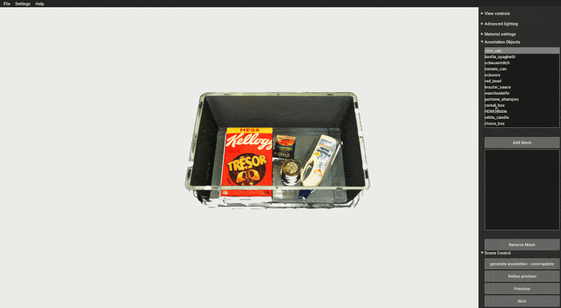
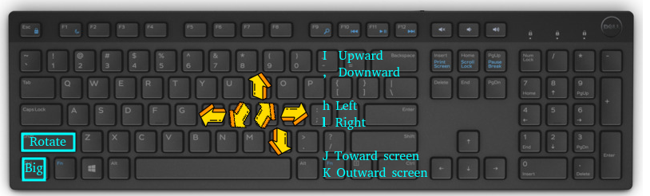

## BOP Annotation Tool

This tool is used to annotate the 6D poses of objects in BOP datasets.
Other annotations can be generated using other scripts like `calc_gt_info.py`, `calc_gt_masks.py`, etc.



### Installation
Install `bop_toolkit_lib` with the `scripts` flag (see [main README](../../README.md#installation))

### Modes

The tool has two modes:

1. individual mode:

Annotate each frame individually. This will save the annotations in the `scene_gt.json` file.
You only need to run the `annotation_tool.py` script and go through each frame of the dataset.

```
python scripts/annotation_tool/annotation_tool.py
```

2. sequence mode:

Annotate a whole sample by annotating the assembled point cloud in the world frame.
This is the case for most BOP datasets (e.g., LM, T-Less).

`assemble_cloud.py` script must be called first to assemble the point cloud for the whole scene.
This will save the annotations in the `scene_gt_world.json` file, which is not the BOP standard.  
Call `project_6D_annotations.py` after annotating to project the annotations to other frames and save them in the `scene_gt.json` file.

```
python scripts/annotation_tool/assemble_cloud.py
python scripts/annotation_tool/project_6D_annotations.py
```

### Interface:

##### individual mode
This image shows the interface of the annotation tool in the individual mode:



Control the object pose with the following keys

`i`: up, `,`: down, `j`: front, `k`:back, `h`:left, `l`:right

These translations are in the camera frame, so in camera axis they are:

`i`: +Y, `,`: -Y, `h`: -X, `l`: +X, `j`: -Z, `k`: +Z

##### sequence mode

In the sequence mode, same buttons are used to control the object pose, but the interface is follow the axis.
The translation/rotation is done in the world frame, so the movement are in the world axis:

`i`: +Z, `,`: -Z, `h`: +Y, `l`: -Y, `j`: -X, `k`: +X


Translation/rotation mode:
- Shift not clicked: translation mode
- Shift clicked: rotation model

Distance/angle big or small:
- Ctrl not clicked: small distance(1mm) / angle(2deg)
- Ctrl clicked: big distance(5cm) / angle(90deg)

R or "Refine" button will call ICP algorithm to do local refinement of the annotation.
If models has texture, a colored ICP will be used, otherwise Point-to-Plane ICP will be used.
If GPU is available, it will be used for ICP, otherwise CPU will be used.
Colored ICP is only available when GPU is available.

A new object is added relative to the camera position.
So to make the annotation process easier you can move the camera to the object position (looking towards the object -z axis) and then add the object.


